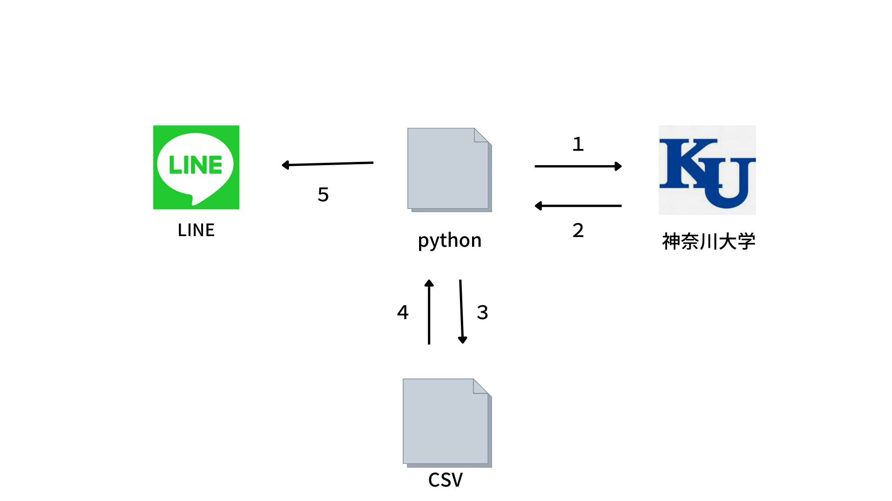

# 大学情報自動転送システム
神奈川大学掲示板から更新された新しい情報をラインに送信する
# 作成の動機
私の通っている大学では、ウェブサイトで更新された大学からの情報はOutlookなどのツールに転送されるようにできています。

しかし、一般的な大学生にとってはOutlookなどのツールは馴染みがなく忙しい時期などには大学から更新された情報を見落としてしまうことがあります。

大事な情報を見落としてしまうことで不利益や機会の損失などが発生してしまうのはとても残念なことです。

そこで、大学生に馴染みのあるLINEに大学からの新しい情報を送信することでこの問題を解決し、大学からの新しい情報の見逃し等を最小限に抑えることができます。
# システム構成

